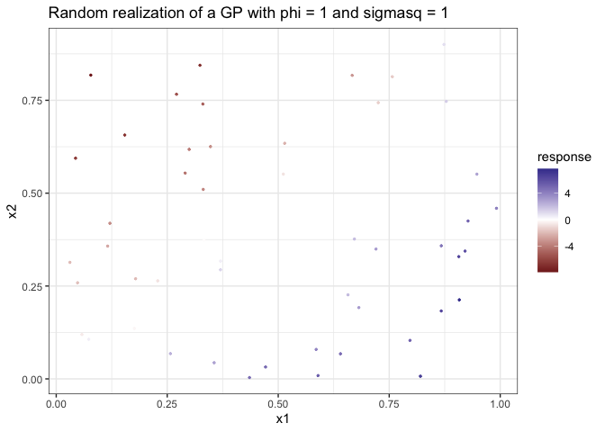

HW3
================

### Q1. GP Regression in 2D (12 points)

This question will continue the theme from the GP Demo on Friday
February 12.

#### Simulate GP regression in 2D (4 points)

Simulate and visualize a GP in 2d with a covariate structure. To keep
this simple, consider an additive relationship with the covariates, x1
and x2. While not required, take some time to explore the impacts of
changing the total number of sampling locations as well as the
parameters in the GP.

``` r
phi <- .25
sigmasq <- 1
n <- 50
x1 <- runif(n)
x2 <- runif(n)
beta1 <- 10
beta2 <- -10
x <- cbind(x1,x2)
d <- sqrt(plgp::distance(x))
eps <- sqrt(.Machine$double.eps) 
H <- exp(-d/phi) + diag(eps, n) 
y <- rmnorm(1, x1 * beta1 + x2 * beta2,sigmasq * H)
reg_fig <- tibble(x1 = x1, x2 = x2, response = y) %>% ggplot(aes(y=x2, x=x1, color = response)) +
  theme_bw() + ggtitle('Random realization of a GP with phi = 1 and sigmasq = 1') +
  geom_point(size = .5) +  scale_colour_gradient2()
reg_fig
```

<!-- -->

#### Stan (4 points)

Now modify the Stan code to estimate this model in 2D. Report how well
your code recovers the parameters (sigmasq, phi, beta0?, beta1?, beta2?)
from your simulated dataset.

``` r
Reg_params <- stan("GP_reg_2d.stan", 
                  data=list(N = n, 
                            y = y,
                            x1 = x1,
                            dist = d,
                            x2 = x2),
                  iter = 2000)
```

    ## Trying to compile a simple C file

#### Make Predictions for a set of locations (4 points)

Using your results from the stan model, make predictions at a set of
locations. The locations can be the entire surface, or just a handful of
points in the space. Include these results in a figure.

``` r
beta1_hat <- summary(Reg_params, pars = 'beta1')$summary[1]
beta2_hat <- summary(Reg_params, pars = 'beta2')$summary[1]
sigmasq_hat <- summary(Reg_params, pars = 'sigmasq')$summary[1]
phi_hat <- summary(Reg_params, pars = 'phi')$summary[1]
npred <- 100
x1new <- runif(npred)
x2new <- runif(npred)
xnew <-cbind(x1new, x2new)
d1 <- sqrt(plgp::distance(xnew))
Sigma11 <- sigmasq_hat * exp(-d1/phi_hat) + diag(eps, npred) 
d12 <- sqrt(plgp::distance(xnew,x))
Sigma12 <- sigmasq_hat * exp(-d12/phi_hat) 
Sigma22 <- sigmasq_hat * exp(-d/phi_hat) + diag(eps, n) 

mu_1given2 <- x1new * beta1_hat + x2new * beta2_hat + Sigma12 %*% solve(Sigma22) %*% matrix(y - x1 * beta1_hat - x2 * beta2_hat, nrow = length(y), ncol = 1)
Sigma_1given2 <- Sigma11 - Sigma12 %*% solve(Sigma22) %*% t(Sigma12)
```

<!-- -->
